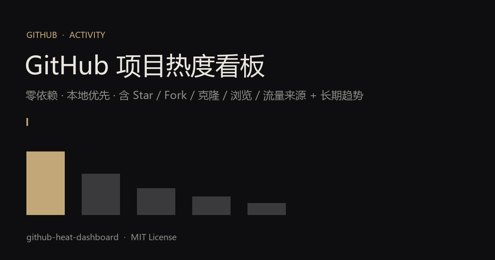

# GitHub Heat Dashboard

一个**零依赖、本地优先**的 GitHub 项目热度看板。用已登录的 `gh` CLI 拉取你账号下所有仓库的 Star、Fork、克隆、浏览与流量来源，并把 GitHub 只保留 14 天的 Traffic 数据每日存档，画成长期趋势。

> **为什么不用现成工具？** 公开的 stat 工具（github-readme-stats / star-history / repobeats）都碰不到 **owner-only 的 Traffic API**（克隆 / 浏览 / 来源）——它们只做 Star / Commit 排行。本方案靠本机 `gh` 登录态直接拉取，不暴露 token、不搭服务器、双击 `index.html` 即开。



## 特性

- **零外部依赖**：纯 HTML/CSS + 内嵌数据，无 CDN、无构建、无后端
- **含真实使用信号**：克隆量、浏览量、流量来源（referrers）
- **长期趋势**：Traffic 仅 14 天窗口，脚本每日存档进 `history.json`，趋势曲线随时间增长
- **单文件自包含**：`collect.py` 把数据内嵌进 `index.html`，`file://` 打开也能看
- **任意账号**：改一个环境变量 / 命令行参数即可换 GitHub 账号

## 快速开始

```bash
# 1. 确认已登录 gh（需 repo 权限以读取 traffic）
gh auth status

# 2. 拉取并生成看板（默认 truman-t3，可用参数 / 环境变量换账号）
python collect.py
#   或：GITHUB_OWNER=your-name python collect.py
#   或：python collect.py your-name

# 3. 打开看板
#   直接浏览器打开 index.html，或起本地服务：
python -m http.server 8777   # 然后访问 http://127.0.0.1:8777/index.html
```

## 看板包含什么

- **KPI 数据栏**：总 Star、近 14 天克隆、近 14 天浏览、公开仓库数
- **Star 与克隆对比**：分组双柱（中性灰 = Star，暖沙金 = 克隆）
- **流量来源**：哪个渠道在带量（github.com / Google / Bing …）
- **长期趋势**：每日快照累计的总克隆 + 总 Star 折线
- **仓库明细表**：可见性、语言、Star、Fork、浏览、克隆、独特克隆

## 持续存档（趋势曲线）

GitHub 自身只保留 14 天流量。建一个每日任务跑 `collect.py`，趋势曲线就会自己变长：

```bash
# crontab 例：每天 09:15 跑
15 9 * * * cd /path/to/github-heat-dashboard && /usr/bin/python3 collect.py
```

（本项目在 WorkBuddy 中附带一个每日自动化配置，可在对话里一键启用。）

## 文件结构

```
github-heat-dashboard/
├── index.template.html   # 页面模板（数据占位符 /*__DASHBOARD_DATA__*/）
├── collect.py            # 抓取 + 存档 + 生成单文件看板
├── index.html            # 生成的看板（每次运行覆盖，已 gitignore）
├── data.js               # 生成的数据文件（已 gitignore）
├── history.json          # 每日快照（已 gitignore，趋势数据源）
└── README.md
```

## 指标说明

| 指标 | 含义 |
|---|---|
| Star | 认可度 / 书签（涨得慢的虚荣指标） |
| Fork | 想改 / 复用你的代码 |
| 克隆 | **最强「真要用」信号** |
| 浏览 | 曝光量（14 天窗口） |
| 来源 | 流量从哪来（谁在带量） |

## License

MIT © truman-t3
